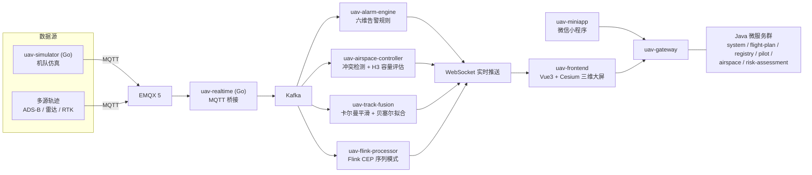
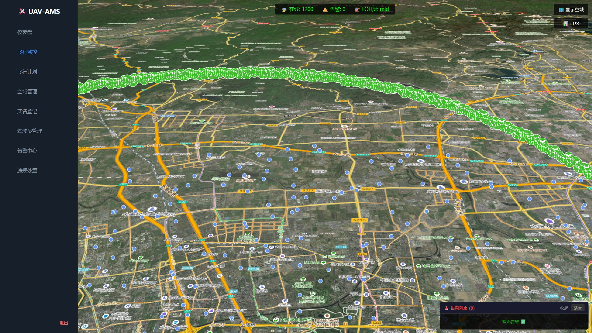
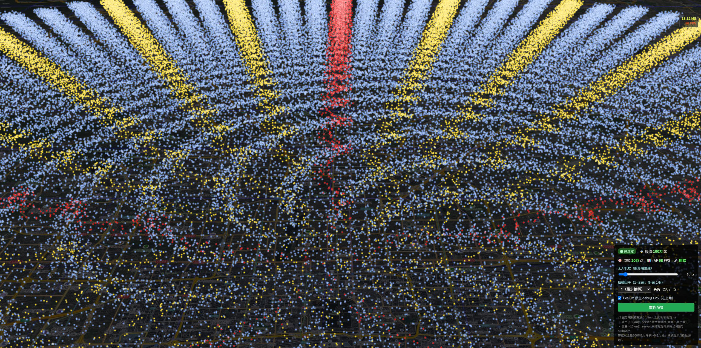
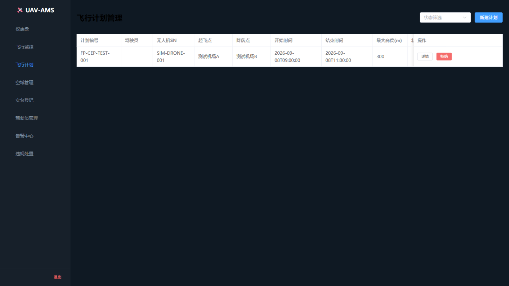
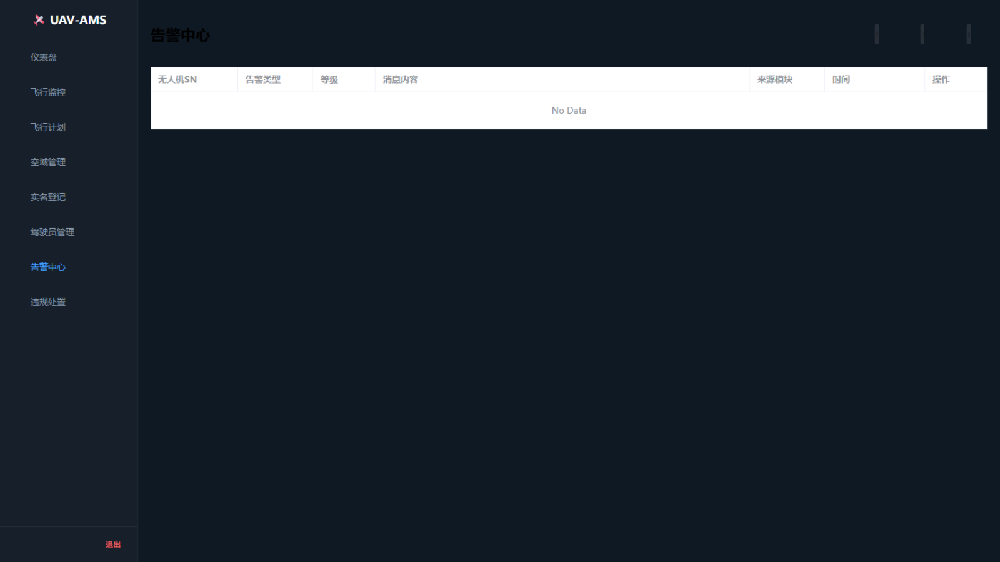

# UAV-AMS · 无人机数字孪生监管平台

> 面向政府监管场景的低空空域数字化平台：**Java 微服务（11 个）+ Go 实时链路（2 个）+ Vue3 / Cesium 数字孪生大屏 + 微信小程序**。
> 覆盖实名登记、飞行员资质、飞行计划多级审批、六维告警、多源轨迹融合、冲突检测、军民协调全业务链。

**▶ 在线演示**：<https://www.lvyanyan.net/apps/uav-ams> —— 缩放规模模拟数据（3 万架 @5Hz，服务端视锥聚合）+ 引导演示动线（自动巡航 + 分段解说），可实测渲染帧率； million-demo 压测工具页见 [million-demo/](million-demo/)。

## 项目亮点

- **百万级渲染压测验证**：自建 Go 仿真器推送 100 万架无人机 @5Hz（100MB/s 二进制帧），前端 Worker 抽稀 + 预分配渲染，实测 **~60FPS · rAF 102 · 0 丢帧**（详见 [million-demo/REPORT.md](million-demo/REPORT.md)）
- **六维告警引擎**：空域入侵 / 气象风险 / 航路偏离 / 设备故障 / 地形碰撞五类规则引擎（Kafka 遥测流实时评估）+ 冲突告警；另有 **Flink CEP 序列模式作业**捕获跨时间窗口行为（异常悬停 / 速度骤降 / 电量骤降）
- **Flink CEP 流式处理**（`uav-flink-processor`）：事件时间语义 + 乱序容忍，三条序列模式与阈值型规则互补，输出复用 `uav.alarm.event` 出口
- **H3 空域网格与容量评估**：uber/h3 官方库（分辨率可配，默认 9 级）做遥测网格索引，冲突检测按 H3 分组预筛（O(N²) → O(N×K)），网格密度实时聚合 + 容量超限告警（仅状态迁移触发）
- **多源轨迹融合**：ADS-B / 雷达 / RTK 多源数据，卡尔曼平滑（`KalmanTrackSmoother`）+ 贝塞尔拟合（`BezierTrackFitter`）
- **冲突检测与解脱**：`ConflictDetector` 实时检测冲突对，预测包络 + 解脱策略引擎（高度 / 航向 / 速度）
- **飞行计划多级审批（Flowable BPMN）**：三级串行审批建模为 BPMN 流程（任务节点 / 排他网关 / 状态同步监听器），REST 契约与旧状态机完全兼容，军民直批自动终止在途实例
- **军民协调**：TOTP 双因子认证 + 一键批准流程
- **外部对接（体检中心 + UOM）**：体检中心定时拉取体检结果自动落库，执照/体检到期自动告警并拦截放行；实名登记审批通过即上报民航局 UOM 平台（Webhook 出站 + 失败重试 + `external_integration_log` 全程留痕），内置 mock 端点可跑通全链路演示
- **完整工程化**：docker-compose 一键基础设施（Flink 走独立 profile）、start-all.bat 全栈启停、RBAC 7 角色 + JWT + MFA、中英双语

## 架构



技术栈：Java 17 · Spring Boot 3.2 + Spring Cloud · MyBatis-Plus · Go 1.21 · Vue3 + TypeScript + Cesium · PostgreSQL 16 + PostGIS · Redis 7 · EMQX 5 · Kafka · Docker Compose

## 服务与端口

| Service | Port | Language | Status |
|---------|:----:|:--------:|:------:|
| uav-gateway (API Gateway) | 8080 | Java | Done |
| uav-system (RBAC+JWT+MFA) | 8081 | Java | Done |
| uav-alarm-engine | 8082 | Java | Done |
| uav-risk-assessment | 8083 | Java | Done |
| uav-airspace-controller | 8084 | Java | Done |
| uav-airspace | 8085 | Java | Done |
| uav-registry | 8086 | Java | Done |
| uav-pilot | 8087 | Java | Done |
| uav-flight-plan | 8088 | Java | Done |
| uav-track-fusion | 8089 | Java | Done |
| uav-realtime (MQTT bridge) | 8090 | Go | Done |
| uav-simulator | - | Go | Done |
| uav-flink-processor | 8081 (WebUI) | Flink 1.18 | Done |
| uav-frontend | 5173 | Vue3 | Done |
| uav-miniapp | - | WeChat | Done |

## Infrastructure (Docker)

| Container | Port |
|-----------|:----:|
| PostgreSQL 16 + PostGIS | 5432 |
| Redis 7 | 6379 |
| EMQX 5 | 1883 |
| Kafka KRaft | 9092 |

## Quick Start

```bash
# Prerequisites: Docker Desktop, JDK 17, Go 1.21+, Node 18+, Maven 3.8+

# Double-click: start-all.bat
# OR manual:
docker-compose -f docker\docker-compose.dev.yml up -d
call mvn clean install -DskipTests
```

## Login

- URL: http://localhost:5173
- Account: admin / admin123

## 流式处理 · H3 网格 · 审批流

### Flink CEP 序列告警（uav-flink-processor）
```bash
# 构建 fat jar（含 connector/cep，本地与集群二用）
mvn -pl uav-flink-processor -am package -DskipTests

# 方式一：本地 MiniCluster 直接跑
java -jar uav-flink-processor/target/uav-flink-processor-1.0.0-SNAPSHOT.jar --bootstrap localhost:9092

# 方式二：Flink 集群（docker compose --profile flink up -d 后）
docker cp uav-flink-processor/target/uav-flink-processor-1.0.0-SNAPSHOT.jar uav-flink-jobmanager:/opt/
docker exec uav-flink-jobmanager flink run -c com.uav.flinkcep.CepAlarmJob /opt/uav-flink-processor-1.0.0-SNAPSHOT.jar --bootstrap kafka:29092
```
三条模式：`ABNORMAL_HOVER`（60s 内 ≥12 条地速 <1m/s）、`SPEED_PLUNGE`（10s 内跌破起点速度 30%）、`BATTERY_PLUNGE`（60s 内电量下降 ≥15 个百分点）。事件时间语义、乱序容忍 5s、10s checkpoint；输出直接进 `uav.alarm.event`，前端零改动。

### H3 空域网格与容量评估（uav-airspace-controller）
- uber/h3 官方库（`com.uber:h3:4.1.1`），分辨率 `airspace.h3-resolution`（默认 9 级 ≈174m 边长）
- 遥测入库即计算 H3 索引；冲突检测按网格分组预筛，复杂度 O(N²) → O(N×K)
- `GET /api/airspace-controller/grid/density` 返回网格密度热力图数据（单元格中心点 + 架数 + 超限标记）
- 容量阈值 `airspace.capacity-max-drones-per-cell`（默认 8）：进入超限状态即发布 `CAPACITY_EXCEEDED` 告警，仅状态迁移触发一次

### 审批流 Flowable BPMN（uav-flight-plan）
- 流程定义：`src/main/resources/processes/flight-plan-approval.bpmn20.xml`（一级 → 二级 → 三级审核，任一节点可驳回）
- 状态同步：任务创建监听器把 BPMN 节点映射回 `PENDING_LEVEL1/2/3`，前端展示行为与旧状态机完全一致
- 军民直批/直撤自动终止在途流程实例，不产生悬挂任务
- 首次启动自动建 `ACT_*` 表（`flowable.database-schema-update: true`）

## 外部对接（体检中心 + UOM）

### 体检中心对接（uav-pilot）
定时拉取模式：每 5 分钟（`uav.medical-center.cron`）从体检中心 API 拉取体检结果，按身份证号（缺失时回退姓名）匹配飞手，`source=CENTER` 幂等落库到 `uav_pilot_medical`（同飞手同体检日期去重）。

```yaml
uav:
  medical-center:
    enabled: true
    base-url: http://localhost:8087/api/pilot/mock-center   # 生产替换为真实体检中心地址
    api-key: dev-key
    cron: "0 */5 * * * *"
```

对端契约：`GET {base-url}/exams`（请求头 `X-API-KEY`）→ `{code:0, data:[{idNumber, pilotName, examDate, examOrg, examResult: PASS|FAIL, expireDate, reportUrl}]}`。内置 mock 端点按库内飞手生成确定性体检目录（1 号飞手体检过期，便于演示告警/放行拦截）。

配套能力：
- **资质到期告警**（uav-alarm-engine，每 10 分钟）：执照/体检过期 → SERIOUS、30 天内到期 → GENERAL，复检/换证后自动关闭；告警 `drone_sn` 存 `PILOT-{id}`；`POST /api/alarm/qualification/check` 手动触发
- **放行检查第 6 项**（uav-flight-plan）：`GET /api/pilot/{id}/medical/valid`——体检过期/不合格 fail-closed 拒绝放行，无体检记录 fail-open 不阻断存量

### UOM 上报（uav-registry）
实名登记 Webhook 出站上报民航局 UOM 平台：审批通过自动上报 + 单条手动 + 批量补报，失败自动重试（每分钟，`max-retry` 上限 5），全程写 `external_integration_log` 留痕；`uav_owner`/`uav_registration` 的 `uom_status`（REPORTED/FAILED/空）在登记页展示。

```yaml
uav:
  uom:
    enabled: true
    base-url: http://localhost:8086/api/registry/mock-uom   # 生产替换为 UOM 真实网关地址
    app-id: uav-ams-demo
    app-secret: dev-secret
    max-retry: 5
```

对端契约：`POST {base-url}/registrations`（请求头 `X-UOM-APP-ID` / `X-UOM-APP-SECRET`）→ HTTP 2xx + `{code:0, data:{receiptNo}}` 视为受理成功。内置 mock 接收端跑通演示链路。

接口一览：

| 接口 | 说明 |
|------|------|
| `POST /api/pilot/medical-center/sync` | 手动触发一次体检中心同步 |
| `GET  /api/pilot/{id}/medical/valid` | 体检有效性核验（放行检查用） |
| `POST /api/alarm/qualification/check` | 手动触发资质到期检查 |
| `PUT  /api/registry/owner/{id}/uom-report` | 手动上报单条所有人登记 |
| `PUT  /api/registry/drone/{id}/uom-report` | 手动上报单条无人机登记 |
| `POST /api/registry/uom/report-all` | 批量补报所有已通过未上报登记（幂等） |
| `POST /api/registry/uom/retry` | 手动重试失败项 |
| `GET  /api/registry/uom/logs?limit=50` | UOM 对接日志 |

## 百万级前端渲染压测

完整报告见 [million-demo/REPORT.md](million-demo/REPORT.md)（含二进制协议定义、复现步骤与生产架构建议），关键数据：

| # | 架构 | 服务端架数 | 渲染点数 | Cesium FPS | rAF | 丢帧 | 结果 |
|---|---|---:|---:|---:|---:|---:|---|
| 1 | v1 全量 JSON + 逐条 upsert | 38 万 | 38 万 | 59 | 28 | 26 | 多重连风暴 |
| 2 | v1 | 17 万 | 17 万 | - | - | - | **卡死** |
| 3 | **v2 二进制 + Worker 抽稀 + 预分配** | **100 万** | **20 万** | **~60** | **102** | **0** | **流畅 ✓** |

两个被实验推翻的初始假设：

1. **「前端纯渲染极限 23 万」→ 错**。实测 20 万点全量动态渲染 rAF 102：stock Cesium 的 `PointPrimitive.position` setter 实际开销仅 ~60ns/点。
2. **「17 万卡死是渲染瓶颈」→ 错**。卡死 100% 源于 `resizeTo` 同步实例化冻结（主线程阻塞 500ms+ 雪崩），与渲染无关。

定位出的两个真实瓶颈及解法：**实例化冻结** → 启动预分配 20 万点、之后永不 resize；**Worker 三角函数超预算** → Worker 端抽稀，只转换会绘制的 ≤20 万点。

## 界面截图









> 补充素材欢迎追加：微信小程序端、轨迹回放、H3 网格热力图（`GET /api/airspace-controller/grid/density`）。前端压测动图参考 `million-demo/`。

## 文档

- [million-demo/REPORT.md](million-demo/REPORT.md) — 百万级渲染压测完整报告
- [million-demo/README.md](million-demo/README.md) — 压测环境复现
- [docs/UAV-AMS-Design-Doc.md](docs/UAV-AMS-Design-Doc.md) — 设计文档
- [docs/PLAN_百万适配与UI升级.md](docs/PLAN_百万适配与UI升级.md) — 迭代任务书与实施记录（含外部对接验收记录）
